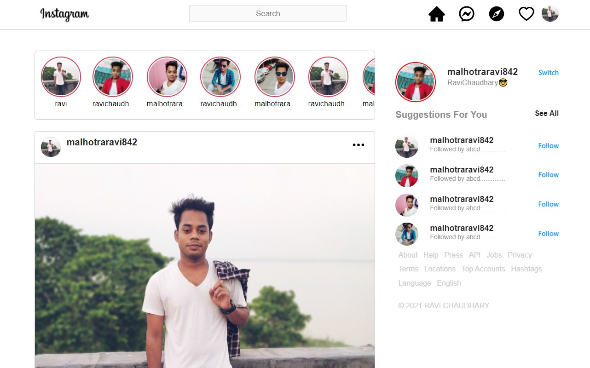
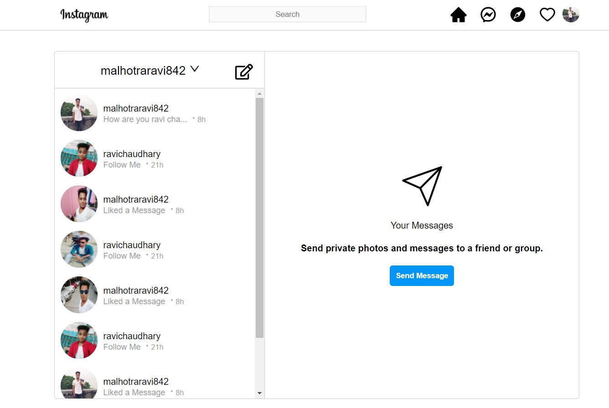

# Instagram Frontend Clone

It's a frontend layout of Instagram developed in React.js




## Tech Stack Used

- React.js

## Installation on Local Machine

To setup this project, Use the package manager [npm](https://nodejs.org/en/) which comes bundled with Node.js.

```bash
npm install

npm start

```
